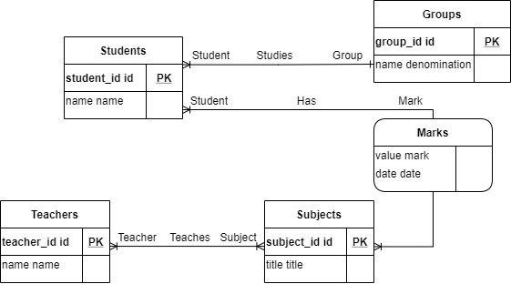

# Homework 2

Design a "University" database to store information about students, groups, faculty, subjects, and grades.

1. Write an entity-relationship model.

   

2. Convert the entity-relationship model into a physical data model.

    

3. [Write the physical model in SQL. The model must include restrictions declarations.](ddl.sql)
4. Create a database based on the designed model.
5. [Write down the SQL operators filling the database with test data.](dml.sql)
