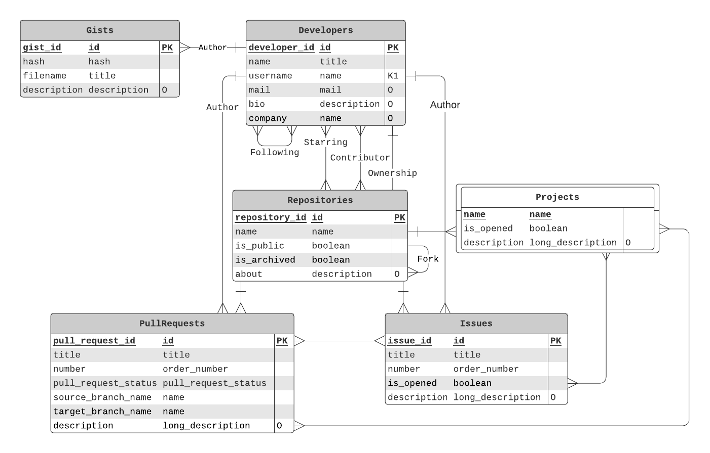
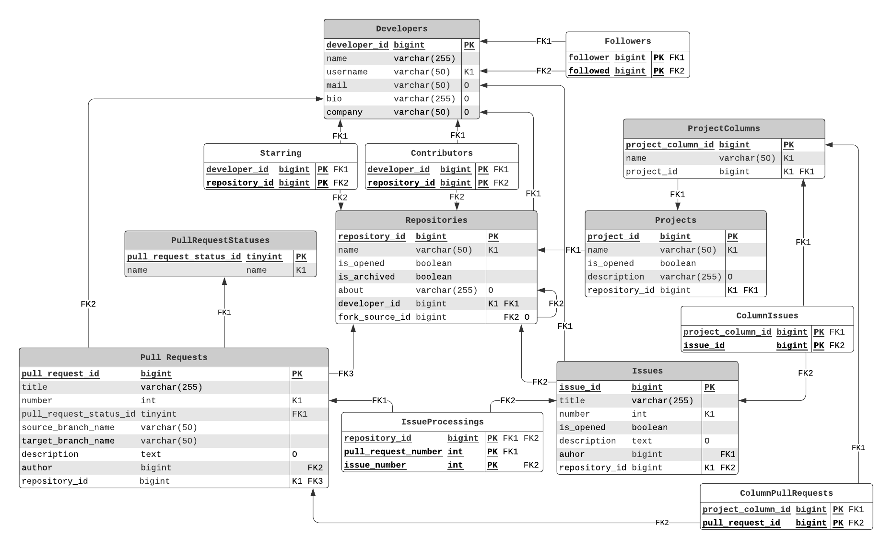

# База данных веб-сервиса для хостинга IT-проектов GitHub

## Описание проекта

Проект содержит описание базы данных, которая могла быть использована для создания веб-сервиса для хостинга проектов
GitHub. Проект не содержит никаких сведений о том, как хранится данные системы контроля версий кода, а лишь содержит
тот дополнительный функционал, предоставляемый сервисом, а именно репозитории, для которых есть pull requests, issues
и projects.

## Построение отношений

В результате предварительного проектирования были выделены следующие отношения:

+ Developers — зарегистрированный пользователь сервиса
+ Repositories — проект пользователя
+ Gists — файлы с кодом, которые хранятся отдельно, вне какого-либо репозитория
+ Projects — milestones, набор задач (PullRequests, Issues) в определённом проектах (например, в рамках одного спринта)
+ PullRequests — запросы на добавление изменений из одной ветки репозитория в другую
+ Issues — ошибки или задачи, которые нужно выполнить для связанного репозитория

### Отношение Developers

Атрибуты:

+ DeveloperId
+ DeveloperName
+ DeveloperUserName
+ DeveloperMail
+ DeveloperBio
+ DeveloperCompany

Функциональные зависимости:

+ DeveloperId → DeveloperName, DeveloperUserName, DeveloperMail, DeveloperBio, DeveloperCompany
+ DeveloperUserName → DeveloperId

Отношение в первой нормальной форме, так как нет повторяющихся групп, атрибуты атомарны и есть ключ DeveloperId.

Отношение находится во второй и третьей нормальных формах, так как все неключевые атрибуты зависят непосредственно лишь от ключей.

Все ключи (DeveloperId и DeveloperUserName) — простые, тогда по первой теореме Дейта-Фейгина отношение в четвёртой и пятой нормальных формах.

### Отношение Followers

Атрибуты:

+ FollowerId
+ FollowedId

Нет нетривиальных функциональные зависимостей

Отношение в первой нормальной форме, так как нет повторяющихся групп, атрибуты атомарны и есть ключ (FollowerId, FollowedId).

Отношение находится во второй и третьей нормальных формах, так как все неключевые атрибуты зависят непосредственно лишь от ключей.

Нет нетривиальных множественных зависимостей (нет зависимости из пустого множества, так как это не декартово произведение по семантике отношения (для разных разработчиков могут быть разные подписанные разработчики)), следовательно, отношение находится в четвёртой нормальной форме.

Так как нет нетривиальных зависимостей соединений (из-за количества атрибутов), то отношение находится в пятой нормальной форме.

### Отношение Contributors

Атрибуты:

+ DeveloperId
+ RepositoryId

Нет нетривиальных функциональные зависимостей

Отношение в первой нормальной форме, так как нет повторяющихся групп, атрибуты атомарны и есть ключ (DeveloperId, RepositoryId).

Отношение находится во второй и третьей нормальных формах, так как все неключевые атрибуты зависят непосредственно лишь от ключей.

Нет нетривиальных множественных зависимостей (нет зависимости из пустого множества, так как это не декартово произведение по семантике отношения (для разных разработчиков могут быть разные репозитории)), следовательно, отношение находится в четвёртой нормальной форме.

Так как нет нетривиальных зависимостей соединений (из-за количества атрибутов), то отношение находится в пятой нормальной форме.

### Отношение Stars

Атрибуты:

+ DeveloperId
+ RepositoryId

Нет нетривиальных функциональные зависимостей

Отношение в первой нормальной форме, так как нет повторяющихся групп, атрибуты атомарны и есть ключ (DeveloperId, RepositoryId).

Отношение находится во второй и третьей нормальных формах, так как все неключевые атрибуты зависят непосредственно лишь от ключей.

Нет нетривиальных множественных зависимостей (нет зависимости из пустого множества, так как это не декартово произведение по семантике отношения (для разных разработчиков могут быть разные репозитории)), следовательно, отношение находится в четвёртой нормальной форме.

Так как нет нетривиальных зависимостей соединений (из-за количества атрибутов), то отношение находится в пятой нормальной форме.

### Отношение Repositories

Атрибуты:

+ RepositoryId
+ RepositoryName
+ RepositoryIsPublic
+ RepositoryIsArchived
+ RepositoryAbout
+ DeveloperId

Функциональные зависимости:

+ RepositoryId → RepositoryName, RepositoryIsPublic, RepositoryIsArchived, RepositoryAbout, DeveloperId
+ RepositoryName, DeveloperId → RepositoryId

Отношение в первой нормальной форме, так как нет повторяющихся групп, атрибуты атомарны и есть ключ RepositoryId.

Отношение находится во второй и третьей нормальных формах, так как все неключевые атрибуты зависят непосредственно лишь от ключей.

Отношение находится в нормальной форме Бойса-Кодда, так как у приведённых нетривиальных зависимостей слева записан надключ. Также существует простой ключ RepositoryId, тогда по второй теореме Дейта-Фейгина, отношение находится в четвёртой нормальной форме.

Доказательство нахождения в пятой нормальной форме аналогично доказательству в случае отношнения Project.

### Отношение Gists

Атрибуты:

+ GistId
+ GistHash
+ GistFilename
+ GistDescription
+ DeveloperId

Функциональные зависимости:

+ GistId → GistHash, GistFilename, FistDescription, DeveloperId
+ DeveloperId, GistHash → GistId

Отношение в первой нормальной форме, так как нет повторяющихся групп, атрибуты атомарны и есть ключ RepositoryId.

Отношение находится во второй и третьей нормальных формах, так как все неключевые атрибуты зависят непосредственно лишь от ключей.

Отношение находится в нормальной форме Бойса-Кодда, так как у приведённых нетривиальных зависимостей слева записан надключ. Также существует простой ключ GistId, тогда по второй теореме Дейта-Фейгина, отношение находится в четвёртой нормальной форме.

Доказательство нахождения в пятой нормальной форме аналогично доказательству в случае отношнения Project.

### Отношение Projects

Атрибуты:

+ ProjectName
+ RepositoryId
+ ProjectIsOpened
+ ProjectDescription

Функциональные зависимости:

+ ProjectName, RepositoryId → ProjectIsOpened, ProjectDescription

Отношение в первой нормальной форме, так как нет повторяющихся групп, атрибуты атомарны и есть ключ ProjectColumnId.

Отношение находится во второй и третьей нормальных формах, так как все неключевые атрибуты зависят непосредственно лишь от ключей.

Отношение находится в нормальной форме Бойса-Кодда, так как у приведённых нетривиальных зависимостей слева записан надключ.

Докажем, что отношение находится в четвёртой нормальной форме: должно не существовать нетривиальной многозначной зависимости вида X ->> Y|Z. Чтобы доказать это утверждение, нужно привести для равных атрибутов из X разные атрибуты из Y и Z. Действительно так можно всегда сделать в данном отношении, так как у нас нет никаких связанных с этим ограничений. Таким образом, нельзя сделать корректную декомпозицию с проекциями на XY и XZ, следовательно, отношение в четвёртой нормальной форме.

Докажем, что отношение Project = R лежит в пятой нормальной форме:
> Для этого попытаемся найти зависимости соединения размера три или четыре, так как множественные зависимости
> уже были рассмотрены. Также заметим, что нет смысла пытаться разъединить ProjectName и RepositoryId, потому что это
> единственный составной ключ, следовательно, рассмотрим только зависимости размера три, где эти два атрибута всегда
> вместе.
>
> Обозначим: ProjectName и RepositoryId = NR, ProjectIsOpened = O, ProjectDescription = D
>
> Нет зависимости соединения *{NR, O, D}, так как иначе получалось бы декартово произведение,
> а это не этот случай по семантике отношения
>
> Нет зависимости соединения *{NR O, O D, D NR}, проверим корректна ли декомпозиция для такого случая
>
> Если мы возьмём следующие строки R = {NR O D}: (A 1, false, D), (A 1, true, C), (B 2, true, D)
>
> При естественном соединении строк:
>
> + NR O: (A 1 ,false), (A 1,true), (B 2, true)
> + O D: (false, D), (true, C), (true, D)
> + NR D: (A 1, D), (A 1, C), (B 2, D)
>
> Что эквивалентно естественному соединению:
>
> + NR O D: (A 1, false, D), (A 1, true, C), (B2, true, C), (A 1 true D), (B 2, true, D)
> + NR D: (A 1, D), (A 1, C), (B 2, D)
>
> В конечном итоге получая:
>
> (A 1, false, D), (A 1, true, C), (A 1, true, D), (B 2, true, D)
>
> Заметим, что  (A 1, true, D) -- лишняя строчка, а, следовательно, декомпозиция некорректна
>
> Таким образом, отношение находится в пятой нормальной форме.

### Отношение PullRequests

Атрибуты:

+ PullRequestId
+ PullRequestTitle
+ PullRequestNumber
+ PullRequestSourceBranchName
+ PullRequestTargetBranchName
+ PullRequestStatus
+ PullRequestDescription
+ DeveloperId
+ RepositoryId

Функциональные зависимости:

+ PullRequestId → PullRequestTitle, PullRequestNumber, PullRequestSourceBranchName, PullRequestTargetBranchName, PullRequestStatus, PullRequestDescription, RepositoryId, DeveloperId
+ RepositoryId, PullRequestNumber → PullRequestId

Отношение в первой нормальной форме, так как нет повторяющихся групп, атрибуты атомарны и есть ключ PullRequestId.

Отношение находится во второй и третьей нормальных формах, так как все неключевые атрибуты зависят непосредственно лишь от ключей.

Отношение находится в нормальной форме Бойса-Кодда, так как у приведённых нетривиальных зависимостей слева записан надключ. Также существует простой ключ PullRequestId, тогда по второй теореме Дейта-Фейгина, отношение находится в четвёртой нормальной форме.

Доказательство нахождения в пятой нормальной форме аналогично доказательству в случае отношнения Project.

### Отношение Issues

Атрибуты:

+ IssueId
+ IssueTitle
+ IssueNumber
+ IssueDescription
+ IssueIsOpened

Функциональные зависимости:

+ IssueId → IssueTitle, IssueNumber, IssueDescription, IssueIsOpened, RepositoryId, DeveloperId
+ RepositoryId, IssueNumber → IssueId

Отношение в первой нормальной форме, так как нет повторяющихся групп, атрибуты атомарны и есть ключ IssueId.

Отношение находится во второй и третьей нормальных формах, так как все неключевые атрибуты зависят непосредственно лишь от ключей.

Отношение находится в нормальной форме Бойса-Кодда, так как у приведённых нетривиальных зависимостей слева записан надключ.
Также существует простой ключ IssueId, тогда по второй теореме Дейта-Фейгина, отношение находится в четвёртой нормальной форме.

Доказательство нахождения в пятой нормальной форме аналогично доказательству в случае отношнения Project.

### Отношение IssueProcessings

Атрибуты:

+ RepositoryId
+ PullRequestNumber
+ IssueNumber

Нет нетривиальных функциональные зависимостей

Отношение в первой нормальной форме, так как нет повторяющихся групп, атрибуты атомарны и есть ключ (RepositoryId, PullRequestNumber, IssueNumber).

Отношение находится во второй и третьей нормальных формах, так как все неключевые атрибуты зависят непосредственно лишь от ключей.

> Докажем, что отношение IssueProcessings = R лежит в четвёртой нормальной форме:
>
> Для этого попытаемся найти нетривиальные множественные зависимости
>
> Обозначим: RI = RepositoryId, PRN = PullRequestNumber и IN = IssueNumber
>
> Замечание: PRN и IN уникальны в контексте одного репозитория и также номер и репозиторий однозначно определяют как
> Issue, так и PullRequest
>
> Нет зависимости RI ->> PRN | IN, так как для одного репозитория могут быть связаны между собой разные Issue и
> PullRequest
>
> Нет зависимости PRN ->> RI | IN, так как одному номеру пулл реквеста могут быть сопоставлены как разные репозитории,
> так и разные номера Issue
>
> Нет зависимости IN ->> PRN | RI, так как это случай симметричный предыдущему
>
> Нет зависимости из пустого множества в X | YZ, где переменные -- это атрибуты из R, так как иначе это было бы
> декартово произведение, а это не так, потому что не должно быть так, что каждой Issue сопоставляется каждый Pull Request
>
> Таким образом, отношение находится в четвёртой нормальной форме.
>
> Докажем, что отношение IssueProcessings = R лежит в пятой нормальной форме:
>
> Для этого попытаемся найти зависимости соединения размера три, так как множественные зависимости уже были рассмотрены.
>
> Нет зависимости соединения *{RI, PRN, IN}, как иначе получалось бы декартово произведение, а это опять же не этот случай
>
> Нет зависимости соединения *{RI PRN, PRN IN, IN RI}, проверим корректна ли декомпозиция для такого случая
>
> Если мы возьмём следующие строки R = {RI PRN IN}: (0, 1, 2), (0, 3, 4), (5, 1, 4)
>
> При естественном соединении строк:
>
> RI PRN: (0, 1), (0, 3), (5, 1)
>
> PRN IN: (1, 2), (3, 4), (1, 4)
>
> RI IN: (0, 2), (0, 4), (5, 4)
>
> Что эквивалентно естественному соединению:
>
> RI PRN IN: (0, 1, 2), (0, 3, 4), (5, 1, 4), (5, 1, 2), (0, 1, 4)
>
> RI IN: (0, 2), (0, 4), (5, 4)
>
> В конечном итоге получая:
>
> (0, 1, 2), (0, 3, 4), (0, 1, 4), (5, 1, 4)
>
> Заметим, что (0, 1, 4) -- лишняя строчка, а, следовательно, декомпозиция некорректна
>
> Таким образом, отношение находится в пятой нормальной форме.

### Отношение ColumnIssues

Атрибуты:

+ RepositoryId
+ ProjectName
+ IssueNumber

Доказательство нахождения в пятой нормальной форме аналогично IssueProcessings.

### Отношение ColumnPullRequests

Атрибуты:
+ RepositoryId
+ ProjectName
+ PullRequestNumber

Доказательство нахождения в пятой нормальной форме аналогично IssueProcessings.

## Модель сущность-связь

## Физическая модель

При построении физической модели использовалось следующее отображение доменов в типы:

| Domain              | Type                             |
| :------------------ | :------------------------------- |
| id                  | bigint                           |
| pull_request_status | enum('open', 'closed', 'merged') |
| name                | varchar(50)                      |
| mail                | varchar(50)                      |
| title               | varchar(255)                     |
| description         | varchar(255)                     |
| long_description    | text                             |
| order_number        | int                              |
| hash                | char(32)                         |

## Определения таблиц

Для реализации проекта использовалась СУБД PostgreSQL 13.0. Определения таблиц и их индексов приведено в файле
[ddl.sql](ddl.sql).

## Тестовые данные

Скрипт для добавления тестовых данных приведен в файле [data.sql](data.sql).

## Запросы на получение данных

В рамках проекта были реализованы следующие запросы:

+ Repository Issues Agenda — информация об открытых issues в репозитории заданного юзера для заданного проекта
+ Repository previews — описание репозиториев, подобное тому, которое можно увидеть на GitHub “pinned repositories” в профиле юзера
+ Contributing Statistics — статистика о деятельности юзеров, эти данные могут быть использованы, чтобы визуализировать их в Activity Overview профиля GitHub юзера
+ Followed Contributions — информация, которую можно увидеть на главной странице GitHub (там это представлено в виде новостей: кто из твоих подписок куда контрибьютил)

Запросы на получение данных и вспомогательные представления приведены в файле [selects.sql](selects.sql).

## Запросы на изменение данных

В рамках проекта были реализованы следующие запросы:

+ ShutProject — закрыть проект в репозитории и все связанные с ним Issues и Pull Requests
+ Merge Pull Request Trigger — вмёржить PR, закрыть связанные Issues, добавить автора в контрибьюторы, если нужно

Запросы на изменение данных, хранимые процедуры и триггеры приведены в файле [updates.sql](updates.sql).
